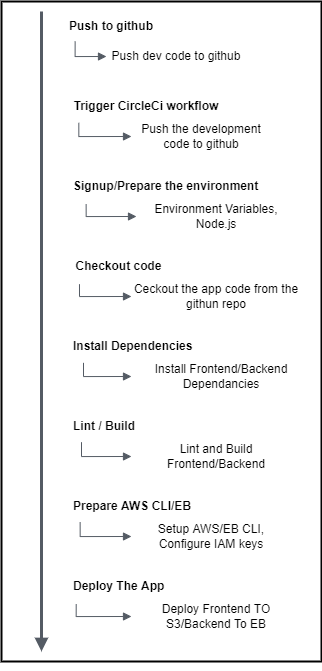

# PIPLELINE
A pipeline is configured to continuously integrate the web application
## Pipleline process order
 - Signup/Prepare the environment
   - Setuo environment variables
   - Setup node.js
 - Install Dependencies
   - Install frontend dependencies
   - Install backend dependencies
 - Lint and Build
   - Lint the code
   - Build the frontend
   - Build the backend
 - Prepare AWS CLI/EB
   - Setup AWS and EB CLIs
   - Configure IAM keys
 - Deploy the App
   - Deploy frontend to S3
   - Deploy backend to EB

